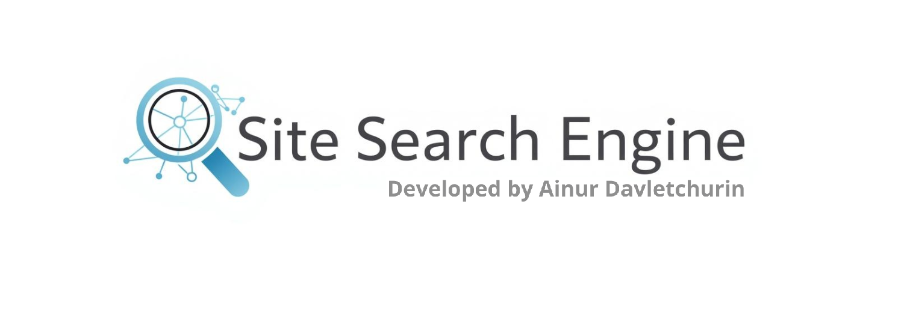

<h1 align="center">Site Search Engine</h1>

    

Проект на языке Java, реализующий полноценный поисковый движок с нуля.  
Приложение анализирует веб-сайты, извлекает и обрабатывает текстовый контент, вычисляет релевантность и предоставляет результаты через REST API.

---

## Описание

Бэкенд проекта был реализован с нуля на языке програмирования Java с использованием фреймворка Spring Boot. Фронтенд этого проекта позволяет взаимодействовать с самим движком.

### Как взаимодействовать?

- **Dashboard** реализует API-запрос /api/statistics
    - Эта вкладка открывается по умолчанию 
    - На нейотображается общая статистика по всем сайтам
    - Также детальная статистика и статус по каждому из сайтов
- **Management** реализует API-запросы: /api/startIndexing, /api/stopIndexing и /api/indexPage
    - На этой вкладке находятся инструменты управления поисковым движком
    - Запуск и остановка полной индексации (переиндексации)
    - Также есть возможность добавить (обновить) отдельнуюстраницу по ссылке
- **Search** реализует API-запрос /api/search
    - Эта страница предназначена для тестирования поискового движка
    - На ней находится поле поиска, выпадающий список с выбором сайта для поиска
    - при нажатии на кнопку «Найти» выводятся результаты поиска

### Что было реализовано?

- **Индексация сайтов**
    - Асинхронная и многопоточная индексация (через `ForkJoinPool`)
    - Парсинг HTML-страниц с помощью Jsoup
    - Сохранение данных (сайты, страницы, леммы, индексы) в MySQL

- **Морфологический анализ**
    - Используется морфологический разбор слов для нормализации форм
    - Поддержка русского и английского языков (через библиотеки Lucene Morphology)

- **Поиск**
    - Поиск по всем проиндексированным сайтам или по выбранному
    - Расчёт релевантности на основе частоты лемм и веса страниц
    - Вывод результатов в JSON-формате (через REST API)

---

## Стек используемых технологий

| Технология | Назначение |
|-------------|------------|
| Java 17 | основной язык разработки |
| Spring Boot | REST API и конфигурация приложения |
| Hibernate / JPA | работа с базой данных |
| MySQL | хранение данных сайтов, лемм и индексов |
| Jsoup | парсинг HTML |
| ForkJoinPool | многопоточная индексация |
| Lucene Morphology | лемматизация слов |
| Maven | сборка и зависимости |